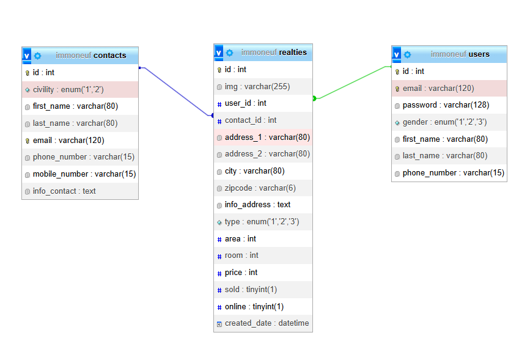
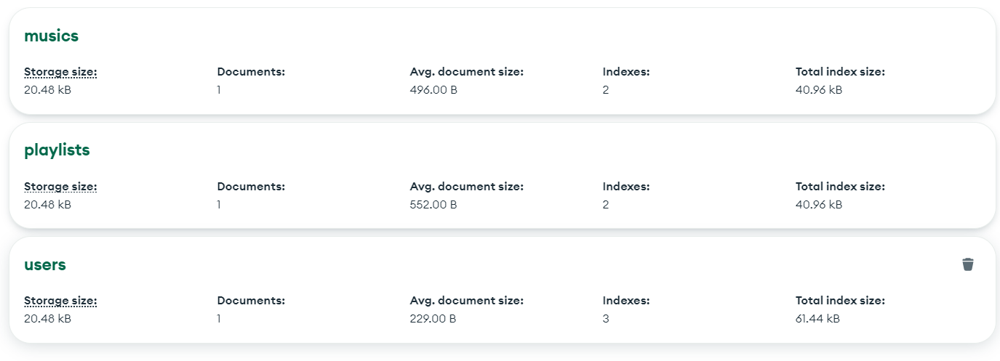
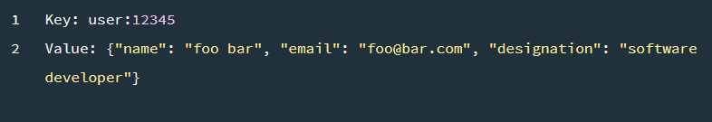
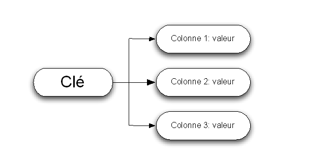
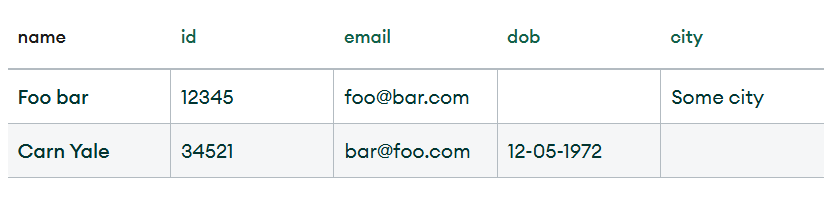
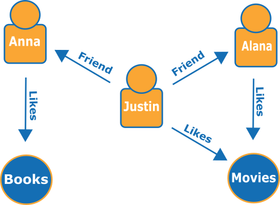
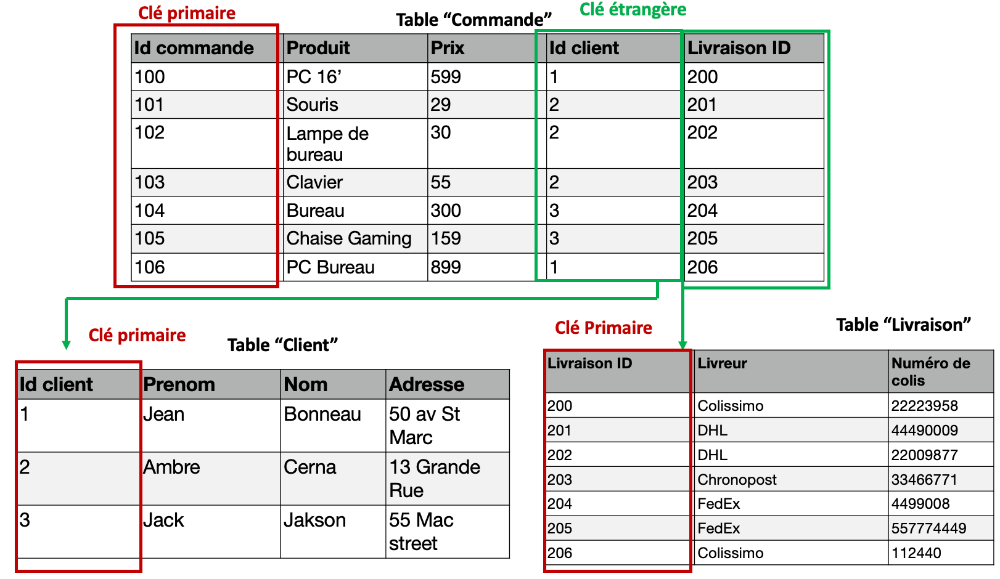
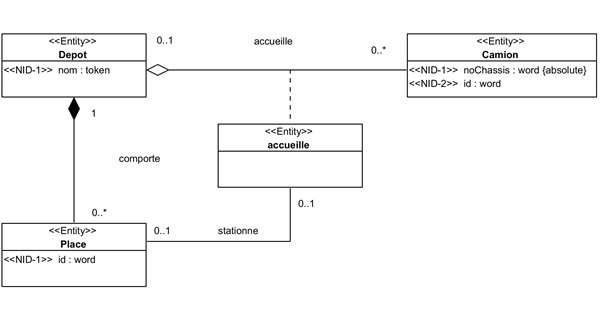
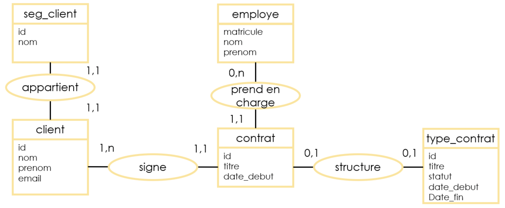

# Partie 1 : Introduction

## Chapitre 1 : Introduction et présentation du programme

### 1. Présentation du programme de la formation

Bienvenue dans cette formation de trois jours sur SQL et MySQL ! Ce programme a été conçu pour vous aider à maîtriser les concepts fondamentaux et les compétences pratiques nécessaires pour travailler avec les bases de données relationnelles en utilisant SQL et MySQL.

Au cours de cette formation, vous apprendrez à créer, gérer et interroger des bases de données à l'aide de différentes techniques et outils.

Dans tous les cas, je vous conseiller d'aller sur le site sql.sh qui est une mine d'or pour apprendre le SQL : https://sql.sh/.

## Chapitre 2 : Qu'est-ce qu'une base de données ?

### 2.1 Introduction aux bases de données

Une base de données est un système organisé de stockage d'informations qui permet d'effectuer des opérations pour créer, modifier, récupérer et supprimer des données. 

Les bases de données relationnelles organisent les données en tables composées de lignes et de colonnes. Chaque table représente une entité (par exemple, un client ou un produit) et chaque ligne représente un enregistrement (une instance de cette entité).

Les termes qui reviennent souvent : 

- SGBD (Système de Gestion de Base de Données) : Un SGBD est un logiciel qui permet de gérer et d'organiser les bases de données. Il offre des fonctionnalités pour la création, la modification, la suppression et la récupération des données, ainsi que pour la gestion des utilisateurs, la sécurité, les sauvegardes, etc. Les exemples courants de SGBD sont MySQL, Oracle, Microsoft SQL Server et PostgreSQL.

- Langage de base de données : Un langage de base de données est un langage spécifique utilisé pour communiquer avec un SGBD et manipuler les données. SQL (Structured Query Language) est le langage de base de données le plus couramment utilisé. Il permet d'effectuer des opérations telles que la création et la modification de schémas de base de données, l'interrogation des données, l'insertion, la mise à jour et la suppression de données, etc.

- Schéma de base de données : Un schéma de base de données définit la structure logique d'une base de données. Il spécifie les tables, les colonnes, les contraintes, les relations et les autres objets de la base de données. Le schéma de base de données décrit la manière dont les données sont organisées et les règles qui s'appliquent à ces données.

- Modèle (logique ou conceptuel) de base de données : Un modèle de base de données est une représentation de la structure d'une base de données. Les modèles de base de données couramment utilisés sont le modèle relationnel, le modèle hiérarchique, le modèle en réseau et le modèle orienté objet. Le modèle relationnel est le plus répandu et utilise des tables, des clés primaires et des relations pour organiser les données.

- Requête SQL : Une requête SQL est une instruction utilisée pour interroger une base de données et récupérer des données spécifiques. Les requêtes SQL peuvent être simples, comme une sélection de toutes les lignes d'une table, ou complexes, impliquant des opérations de jointure, des conditions et des agrégations.

- Index : Un index est une structure de données utilisée pour accélérer la recherche des données dans une base de données. Il améliore les performances en créant un moyen rapide d'accéder aux enregistrements en fonction de certaines colonnes. Les index sont souvent créés sur des colonnes fréquemment utilisées dans les requêtes de recherche pour réduire le temps de recherche.

- Une clause en SQL est une instruction ou une partie spécifique d'une requête qui définit une action ou une condition particulière. Les clauses sont utilisées pour spécifier les opérations à effectuer lors de l'exécution d'une requête SQL, telles que la sélection, la filtration, le tri ou la jointure des données.
  Les clauses sont généralement combinées pour former une requête SQL complète. Chaque clause a un objectif spécifique et contribue à déterminer les résultats et le comportement de la requête.

- NoSQL : Le terme « NoSQL » désigne les différents types de bases de données non relationnelles. Ces bases de données stockent les données dans un format différent. Toutefois, les bases de données NoSQL peuvent être interrogées à l'aide d'API en langage idiomatique, de langages déclaratifs et de langages de requête par exemple, ce qui explique pourquoi elles sont également considérées comme des bases de données « pas seulement SQL ».

## Chapitre 3 : Introduction à SQL et MySQL

### 3.1 Qu'est-ce que SQL ?

SQL (Structured Query Language) est un langage de programmation standardisé utilisé pour communiquer avec des bases de données relationnelles. SQL permet d'effectuer des opérations telles que la création, la modification, la suppression et la récupération de données à partir de bases de données.

Ces bases de données relationnelles se composent de 3 parties :

- **Les Tables** : Un tableau de colonnes et de lignes. L’ensemble des tables composent la base de données (BDD).
- **Les Colonnes** définissent les différentes catégories qui composent les informations d’une donnée.
- **La clé primaire** et **la clé étrangère** permettent de mettre en relation différentes tables.

### 3.2 Qu'est-ce que MySQL ?

MySQL est un système de gestion de bases de données relationnelles (SGBD / RDBMS en anglais) open source et gratuit. 
Un SGBD est un logiciel qui permet a des utilisateurs d'interagir avec une base de données sans avoir à gérer de nombreux aspects complexes (par exemple, le stockage des données, la sécurité, les sauvegardes, etc.).

MySQL est l'un des SGBD les plus populaires au monde. Il est utilisé par de nombreuses entreprises et organisations, dont Facebook, Twitter, YouTube, Netflix, Airbnb, Uber, etc.

*Exemple de base de donnée relationnel :*
{ style="display: block; margin: 0 auto" }

## Chapitre 4 : Introduction à NoSQL

### 4.1 Qu'est ce que le NoSQL ?

Les bases de données NoSQL (ou « *not only SQL* ») stockent les données différemment des tables relationnelles. Les bases de données NoSQL sont disponibles dans différents types en fonction de leur modèle de données, dont les principaux sont document, clé-valeur, orientée colonnes et graphique. Elles fournissent des schémas flexibles et s’adaptent facilement à de grandes quantités de big data et à des charges d’utilisateurs élevées.

### 4.2 Bases de données documents

Une **base de données orientée documents** est une base de données destinée aux applications qui gèrent des documents. Également nommée « *magasin de documents* », c'est un programme informatique et un système de stockage de données conçu pour stocker, récupérer et gérer des informations orientées documents, également appelées données semi-structurées.

*Exemple de base de données orientée documents :*
{ style="display: block; margin: 0 auto" }

Deux langages sont maintenant principalement utilisés pour représenter les documents structurés : **XML** et **JSON**.

*Exemple de document structuré :*
{ style="display: block; margin: 0 auto" }

### 4.3 Bases de données clé-valeur

Un magasin **clé-valeur** est un type de base de données plus simple où chaque élément contient des clés et des valeurs. Chaque clé est unique et associée à une seule valeur. Elles sont utilisées pour la mise en cache et la gestion de session et offrent des performances élevées en lecture et en écriture, car elles stockent généralement les éléments en mémoire.

*Exemple de structure de base de donnée clé-valeur :*
{ style="display: block; margin: 0 auto" }

*Exemple de donnée clé-valeur :*
{ style="display: block; margin: 0 auto" }

### 4.4 Bases de données orientées colonnes

Les **bases de données orientées colonnes**, ou **magasins orientés colonnes**, stockent et lisent des données en lignes et sont organisées sous forme d'ensemble de colonnes.

*Exemple de structure de base de donnée orientée colonne :*
{ style="display: block; margin: 0 auto" }

Ces bases de données peuvent utiliser des techniques de compression de colonne pour réduire l’espace de stockage et améliorer les performances. La taille importante des lignes et des colonnes permet une récupération efficace des données disparates et volumineuses.

*Exemple de donnée orientée colonne :*
{ style="display: block; margin: 0 auto" }

### 4.5  Bases de données graphiques

Une **base de données graphique** stocke les données sous la forme de nœuds et d'arêtes. Les nœuds stockent généralement des informations sur les personnes, les lieux et les objets (comme les noms), tandis que les arêtes stockent des informations sur les relations entre les nœuds. Ce mécanisme fonctionne bien pour les données fortement connectées, où les relations ou les schémas ne sont pas toujours évidents au départ.

*Exemple de base de donnée graphique :*
{ style="display: block; margin: 0 auto" }

---

# Partie 2 : Installation

## Chapitre 1 : Installation de MySQL

Pour installer MySQL sur votre ordinateur, suivez les instructions fournies par la documentation officielle : https://dev.mysql.com/doc/refman/8.0/en/installing.html

## Chapitre 2 : Installation d'un outil de gestion

Après avoir installé MySQL, il est recommandé d'installer un outil de gestion de bases de données pour faciliter le travail avec MySQL. Voici deux options populaires :

- MySQL Workbench : un outil graphique de gestion de bases de données MySQL. Pour l'installer, suivez les instructions sur le site officiel : https://www.mysql.com/products/workbench/

- phpMyAdmin : un outil web de gestion de bases de données MySQL. Pour l'installer, suivez les instructions sur le site officiel : https://www.phpmyadmin.net/

Pour nous faciliter la vie, nous allons utiliser un package de logiciels, comprenant MySQL et phpMyAdmin, qui s'appelle Wampp. Pour l'installer, suivez les instructions sur le site officiel : https://www.wampserver.com/

Il permet d'installer d'un coup : Apache, MySQL, et PHP

---

# Partie 3 : Qu'est-ce qu'une requête SQL ?

## Chapitre 1 : Bases de SQL et syntaxe

### 1.1 Requête SQL : Une question à la base de données

Une **requête SQL** est la **commande SQL** la plus élémentaire. Il s'agit d'une question que vous posez à une base de données. Dans ce chapitre, nous allons nous plonger dans les connaissances de base des requêtes SQL pour vous permettre de démarrer votre voyage dans SQL avec des connaissances pratiques dès maintenant !

Une requête SQL est une commande utilisée pour extraire des données d'une base de données. C'est un instrument flexible qui permet d'accéder aux données nécessaires.

Une requête SQL est essentiellement **une question qu'un utilisateur pose à une base de données**. Les questions peuvent varier en complexité, de " *quels sont les modèles de voitures vendus ?* " à " *combien de voitures Volvo sont vendues en moyenne à l'entreprise de M. Dupont chaque année ?* ".

```sql
SELECT colonne,
FROM nom_de_la_table
```

Ici, la requête est composé de deux clauses (deux questions).

Par convention, les mots clés SQL sont écrits en majuscules. Cependant, il est possible d'écrire les mots clés en minuscules, mais cela peut rendre la requête plus difficile à lire.

De plus, il est conseillé de revenir à la ligne après chaque clause pour améliorer la lisibilité de la requête.

### 1.2 Les types de données SQL

Les types de données SQL sont utilisés pour définir le type de données que peut contenir une colonne. Voici quelques types de données courants :

- INT : un entier (nombre entier)
- FLOAT : un nombre à virgule flottante (nombre réel)
- VARCHAR(n) : une chaîne de caractères de longueur variable, où n est la longueur maximale
- DATE : une date (AAAA-MM-JJ)
- DATETIME : une date et heure (AAAA-MM-JJ HH:MM:SS)

Pour commencer, on ne va pas construire nous même les bases de données, nous allons utiliser des bases de données déjà existantes. Nous n'avons donc pas d'intérêt a développer davantage les types de données.

### 1.3 Les opérateurs SQL

Les opérateurs SQL permettent de comparer, combiner ou effectuer des opérations sur les données. Voici quelques opérateurs courants :

* = : égal
* <> ou != : différent
* < : inférieur
* \> : supérieur
* <= : inférieur ou égal
* \>= : supérieur ou égal
* AND : combine deux conditions, toutes deux doivent être vraies
* OR : combine deux conditions, l'une d'elles doit être vraie
* NOT : inverse la condition

### 1.4 Les clauses SELECT, FROM et WHERE

- SELECT : spécifie les colonnes à récupérer dans la requête
- FROM : spécifie la table à partir de laquelle récupérer les données
- WHERE : spécifie une condition que les enregistrements doivent respecter pour être récupérés

```sql
SELECT nom, prenom
FROM utilisateurs
WHERE email = 'titi.dupont@email.com';
```

Ici notre requête nous renverra les **noms** et **prénoms** des **utilisateurs** dont l'**email** correspondra à *titi.dupont@email.com*

**Pratiquons !!**

Rdv au fichier exo.md niveau 1

## Chapitre 2 : Filtrage et tri des données

### 2.1 Utilisation de AND, OR et NOT

Les opérateurs AND, OR et NOT permettent de combiner ou de modifier des conditions dans une clause WHERE.

```sql
-- Exemple avec AND
SELECT nom, prenom
FROM utilisateurs
WHERE email = 'titi.dupont@email.com' AND nom = 'dupont';

-- Exemple avec OR
SELECT nom, prenom
FROM utilisateurs
WHERE email = 'titi.dupont@email.com' OR nom = 'tata.mercier@email.com';

-- Exemple avec NOT
SELECT nom, prenom
FROM utilisateurs
WHERE NOT email = 'titi.dupont@email.com';
```

### 2.2 Opérateurs de comparaison

Les opérateurs de comparaison permettent de comparer les valeurs des colonnes aux valeurs spécifiées.

```sql
-- Exemple avec < (inférieur à)
SELECT nom, prenom
FROM utilisateurs
WHERE age < 30;

-- Exemple avec >= (supérieur ou égal à)
SELECT nom, prenom
FROM utilisateurs
WHERE age >= 18;
```

### 2.3 Fonctions d'agrégation (COUNT, SUM, AVG, MIN, MAX)
Les fonctions d'agrégation permettent de réaliser des calculs sur un ensemble de lignes. Voici quelques fonctions d'agrégation courantes :

- COUNT(): compte le nombre de lignes
- SUM(): calcule la somme des valeurs d'une colonne
- AVG(): calcule la moyenne des valeurs d'une colonne
- MIN(): trouve la valeur minimale d'une colonne
- MAX(): trouve la valeur maximale d'une colonne

```sql
-- Exemple avec COUNT()
SELECT COUNT(*) AS nombre_clients
FROM clients;

-- Exemple avec SUM()
SELECT SUM(salaire) AS total_salaires
FROM employes;

-- Exemple avec AVG()
SELECT AVG(salaire) AS salaire_moyen
FROM employes;

-- Exemple avec MIN()
SELECT MIN(salaire) AS salaire_min
FROM employes;

-- Exemple avec MAX()
SELECT MAX(salaire) AS salaire_max
FROM employes;
```

**Pratiquons !!**

Rdv au fichier exo.md niveau 2

### 2.4 Tri des données avec ORDER BY

La clause ORDER BY permet de trier les résultats d'une requête selon une ou plusieurs colonnes.

```sql
-- Trier les clients par nom (ordre croissant)
SELECT nom, prenom, email
FROM clients
ORDER BY nom ASC;

-- Trier les clients par nom (ordre décroissant)
SELECT nom, prenom, email
FROM clients
ORDER BY nom DESC;

-- Trier les clients par nom, puis par prénom
SELECT nom, prenom, email
FROM clients
ORDER BY nom ASC, prenom ASC;

-- Trier les clients par nom croissant, puis par prénom (ordre décroissant)
-- C'est étrange mais possible !
SELECT nom, prenom, email
FROM clients
ORDER BY nom ASC, prenom DESC;
```

### 2.5 Limitation des résultats avec LIMIT

La clause LIMIT permet de limiter le nombre de lignes renvoyées par une requête.

```sql
-- Récupérer les 10 premiers clients
SELECT nom, prenom, email
FROM clients
ORDER BY nom ASC
LIMIT 10;

-- Récupérer les clients 11 à 20
SELECT nom, prenom, email
FROM clients
ORDER BY nom ASC
LIMIT 10 OFFSET 10;
```

**Pratiquons !!**

Rdv au fichier exo.md niveau 3

## Chapitre 3 : Les requêtes de tri et de regroupement personnalisées.

### 3.1 Utilisation de LIKE et NOT LIKE

L'opérateur LIKE permet de rechercher des enregistrements qui correspondent à un modèle spécifique. Il est souvent utilisé avec le caractère générique %, qui correspond à n'importe quelle chaîne de caractères.

```sql
-- Récupérer les clients dont le nom commence par 'D'
SELECT nom, prenom, email
FROM clients
WHERE nom LIKE 'D%';

-- Récupérer les clients dont le nom se termine par 'on'
SELECT nom, prenom, email
FROM clients
WHERE nom LIKE '%on';

-- Récupérer les clients dont le nom contient 'on'
SELECT nom, prenom, email
FROM clients
WHERE nom LIKE '%on%';

-- Récupérer les clients dont le nom ne contient pas 'on'
SELECT nom, prenom, email
FROM clients
WHERE nom NOT LIKE '%on%';
```

### 3.2 Utilisation de IN et NOT IN

L'opérateur IN permet de rechercher des enregistrements dont la valeur d'une colonne correspond à l'une des valeurs spécifiées.

```sql
-- Récupérer les clients dont le nom est 'Dupont' ou 'Durand'
SELECT nom, prenom, email
FROM clients
WHERE nom IN ('Dupont', 'Durand');

-- Récupérer les clients dont le nom n'est pas 'Dupont' ou 'Durand'
SELECT nom, prenom, email
FROM clients
WHERE nom NOT IN ('Dupont', 'Durand');
```

**Pratiquons !!**

Rdv au fichier exo.md niveau 4

### 3.3 Utilisation de BETWEEN et NOT BETWEEN

L'opérateur BETWEEN permet de rechercher des enregistrements dont la valeur d'une colonne est comprise entre deux valeurs spécifiées.

```sql
-- Récupérer les clients dont l'âge est compris entre 20 et 30 ans
SELECT nom, prenom, email
FROM clients
WHERE age BETWEEN 20 AND 30;

-- Récupérer les clients dont l'âge n'est pas compris entre 20 et 30 ans
SELECT nom, prenom, email
FROM clients
WHERE age NOT BETWEEN 20 AND 30;
```

### 3.4 Utilisation de IS NULL et IS NOT NULL

L'opérateur IS NULL permet de rechercher des enregistrements dont la valeur d'une colonne est NULL.

```sql
-- Récupérer les clients dont l'adresse est NULL
SELECT nom, prenom, email
FROM clients
WHERE adresse IS NULL;

-- Récupérer les clients dont l'adresse n'est pas NULL
SELECT nom, prenom, email
FROM clients
WHERE adresse IS NOT NULL;
```

**Pratiquons !!**

Rdv au fichier exo.md niveau 5

### 3.5 Utilisation de GROUP BY et HAVING

La clause GROUP BY permet de regrouper les enregistrements ayant la même valeur dans une colonne. La clause HAVING permet de filtrer les résultats d'une requête GROUP BY.

```sql
-- Récupérer le nombre de clients par ville
SELECT ville, COUNT(*) AS nombre_clients
FROM clients
GROUP BY ville;

-- Récupérer les villes ayant plus de 10 clients
SELECT ville, COUNT(*) AS nombre_clients
FROM clients
GROUP BY ville
HAVING COUNT(*) > 10;
```

### 3.6 Utilisation de DISTINCT

L'opérateur DISTINCT permet de supprimer les doublons des résultats d'une requête.

```sql
-- Récupérer les villes des clients
SELECT ville
FROM clients;

-- Récupérer les villes des clients (sans doublons)
SELECT DISTINCT ville
FROM clients;
```

### 3.7 Utilisation de AS

L'opérateur AS permet de renommer une colonne ou une table dans une requête.

```sql
-- Récupérer les villes des clients (avec un alias)
SELECT DISTINCT ville AS ville_client
FROM clients;
```

**Pratiquons !!**

Rdv au fichier exo.md niveau 6


Dans cette session, nous avons couvert les bases de la syntaxe SQL, les opérateurs, les types de données, et les clauses pour filtrer, trier et limiter les résultats des requêtes. Dans la session suivante, nous aborderons des sujets plus avancés, tels que les manipulations de données et les jointures.

---

# Partie 3 : Les requêtes de selection avancées

## Chapitre 1 : Jointures entre tables

Les jointures permettent de combiner des données provenant de plusieurs tables. Il existe différents types de jointures, dont les plus courants sont INNER JOIN, LEFT JOIN, RIGHT JOIN et FULL OUTER JOIN.

### 1.1 INNER JOIN

L'INNER JOIN renvoie les enregistrements qui ont des correspondances dans les deux tables.

```sql
-- Récupérer les clients et leurs commandes
SELECT clients.nom, clients.prenom, commandes.date
FROM clients
INNER JOIN commandes ON clients.id = commandes.client_id;
```

### 1.2 LEFT JOIN

Le LEFT JOIN renvoie tous les enregistrements de la table de gauche, et les enregistrements correspondants de la table de droite. Si aucune correspondance n'est trouvée, les résultats de la table de droite sont NULL.

```sql
-- Récupérer tous les clients et leurs commandes éventuelles
SELECT clients.nom, clients.prenom, commandes.date
FROM clients
LEFT JOIN commandes ON clients.id = commandes.client_id;
```

### 1.3 RIGHT JOIN

Le RIGHT JOIN renvoie tous les enregistrements de la table de droite, et les enregistrements correspondants de la table de gauche. Si aucune correspondance n'est trouvée, les résultats de la table de gauche sont NULL.

```sql
-- Récupérer toutes les commandes et leurs clients éventuels
SELECT clients.nom, clients.prenom, commandes.date
FROM clients
RIGHT JOIN commandes ON clients.id = commandes.client_id;
```

### 1.4 CROSS JOIN

Un CROSS JOIN est un type de jointure SQL qui produit le produit cartésien de deux tables. Cela signifie que chaque ligne de la première table est combinée avec chaque ligne de la seconde table, résultant en un tableau où le nombre de lignes est égal au produit du nombre de lignes des deux tables jointes.

En d'autres termes, si la première table contient n lignes et la deuxième table m lignes, le résultat du CROSS JOIN contiendra n x m lignes. Un CROSS JOIN ne nécessite aucune condition de jointure spécifiée (ON), car chaque combinaison possible de lignes entre les deux tables est automatiquement incluse dans le résultat.

Voici un exemple simple pour illustrer un CROSS JOIN :

Supposons que nous ayons deux petites tables :

Table A:

| **ID**|**Nom**|
|:-:    |:-:    |
|1      |Marie  |
|2      |Pierre |

Table A:

| **ID**|**Couleurs**|
|:-:    |:-:         |
|1      |Violet      |
|2      |Orange      |

La requête SQL utilisant un CROSS JOIN entre ces deux tables serait :
```sql
SELECT A.nom, B.couleur
FROM Table A
CROSS JOIN Table B;
```

Le résultat serait :

| **Nom**|**Couleur**|
|:-:     |:-:        |
|Marie   |Violet     |
|Marie   |Orange     |
|Pierre  |Violet     |
|Pierre  |Orange     |

Comme on peut le voir, chaque nom est associé à chaque couleur, formant toutes les combinaisons possibles.


**Pratiquons !!**

Rdv au fichier exo.md niveau 7

## Chapitre 2 : Sous-requêtes

### 2.1 Utilisation de sous-requêtes dans une clause WHERE

Une sous-requête est une requête imbriquée dans une autre requête. Elle peut être utilisée dans une clause WHERE pour filtrer les résultats d'une requête.

Cette solution existe mais il est préférable d'utiliser les jointures, qui sont plus performantes et surtout plus lisibles.

```sql
-- Récupérer les clients ayant passé au moins une commande
SELECT nom, prenom
FROM clients
WHERE id IN (
    SELECT client_id
    FROM commandes
);
```

### 2.2 Utilisation de sous-requêtes dans une clause FROM

Une sous-requête peut être utilisée dans une clause FROM pour créer une table temporaire à partir de laquelle récupérer les données.

```sql
-- Récupérer les clients ayant passé au moins une commande
SELECT clients.nom, clients.prenom, commandes.nombre
FROM (
    SELECT id, nom, prenom
    FROM clients
) AS clients
INNER JOIN (
    SELECT client_id, COUNT(*) AS nombre
    FROM commandes
    GROUP BY client_id
) AS commandes ON clients.id = commandes.client_id;
```

---

# Partie 4 : Les requêtes de modification de données

## Chapitre 1 : Manipulation des données

### 1.1 Insertion de données avec INSERT INTO

La commande INSERT INTO permet d'ajouter de nouveaux enregistrements à une table.

```sql
-- Insérer un client dans la table clients
INSERT INTO clients (nom, prenom, email)
VALUES ('Martin', 'Pierre', 'pierre.martin@email.com');
```

### 1.2 Mise à jour des données avec UPDATE

La commande UPDATE permet de modifier des données existantes dans une table.

```sql
-- Mettre à jour l'adresse e-mail d'un client
UPDATE clients
SET email = 'pierre.martin@nouveau-email.com'
WHERE id = 1;
```

### 1.3 Suppression des données avec DELETE

La commande DELETE permet de supprimer des enregistrements d'une table.

```sql
-- Supprimer un client de la table clients
DELETE FROM clients
WHERE id = 1;
```

**Pratiquons !!**

Rdv au fichier exo.md niveau 8

---

# Partie 5 : Création de base de donnée

## Chapitre 1 : Clé primaire et clé étrangère 

Les **clés** sont essentielles dans une base de données relationnelle pour garder les tables connectées ou identifier de manière unique les données des tables. Une **clé primaire** identifie les données de manière unique, donc deux lignes ne partagent pas la même clé primaire et ne peuvent pas être nulles. Alors qu’une **clé étrangère** relie deux tables entre elles.  

Une clé primaire d'une table servant de clé étrangère dans une autre est un moyen courant de garantir l'intégrité des données. Il garantit que les données de la table de référencement (celle avec la clé étrangère) ont un lien valide vers la table référencée (celle avec la clé primaire). Cette empêche les enregistrements orphelins et maintient la cohérence dans la base de données.  

### 1.1 Clé primaire

Une clé primaire identifie chaque ligne d'une table. Elle est contenu dans une table parent. Une clé primaire peut être une colonne individuelle ou un groupe de colonnes. Pour insérer, mettre à jour, restaurer ou supprimer des opérations dans une table de base de données, la table doit avoir une clé primaire.  

Avoir une clé primaire est significative pour:  

- Identifier de manière unique les lignes d'une table ou d'enregistrements pour les récupérer, les mettre à jour ou les supprimer facilement.  
- La clé primaire dans les SGBD comme MySQL et Oracle est d'habitude un entier auto-incrémenté. Cette signifie que la base de données attribue automatiquement à chaque nouvel enregistrement un nouveau numéro, en s'assurant que chaque ligne a son identifiant unique.

### 1.2 Clé étrangère  

Une clé étrangère est un point de référence dans une base de données relationnelle qui établit des relations entre deux tables, garantissant ainsi la cohérence et l'intégrité des données. Contrairement à la clé primaire, elle est présente dans une table enfant.

Lorsque vous appliquez une contrainte de clé étrangère à la colonne d'une table, elle doit faire référence à la clé primaire de la colonne d'une autre table. Cette liaison maintient une structure relationnelle, connectant les données entre différentes tables.

Les clés étrangères répondent à plusieurs besoins dans un modèle de base de données :

- Les clés étrangères garantissent l'intégrité des données en maintenant la cohérence, l'exhaustivité et l'exactitude des tableaux associés.  
- Elless optimisent les performances des requêtes en facilitant des plans de requête efficaces, en accélérant la récupération des données et en améliorant les relations entre les tables.  
- Les clés étrangères sont essentielles pour établir des relations entre les tables, permettant le stockage et la récupération de données liées sur plusieurs tables. 

### 1.3 Comparaison des clés primaires et étrangères

Comme nous l'avons vu précèdement, les clés primaires et étrangères jouent des rôles importants mais distincts dans le maintien de l'intégrité des données et l'établissement de connexions significatives dans les bases de données. Bien que les deux impliquent l’identification de points de données, ils répondent à des objectifs différents et possèdent des caractéristiques uniques. Voici comment les clés primaires et étrangères se comparent selon plusieurs facteurs clés :

- **Objectif** : le seul objectif de la clé primaire est d'identifier de manière unique chaque enregistrement de table. En revanche, la clé étrangère fait référence à la clé primaire d'une autre table, établissant une relation et permettant la récupération de données sur différentes tables. Cela vous permet de connecter les informations associées et de voir l’aperçu unifié au sein de votre base de données.

- **Unicité** : la clé primaire doit contenir une valeur unique pour chaque enregistrement de la table. Il ne peut y avoir de doublons – chaque enregistrement a besoin de son identifiant distinct.
L'unicité au sein de sa table est facultative pour une clé étrangère. Mais il doit faire référence à une valeur unique dans la clé primaire de la table vers laquelle il pointe. Il ne peut se connecter qu’à un seul point bien défini de l’autre côté.

- **Nullabilité** : les valeurs nulles ne sont généralement pas autorisées dans la clé primaire. Chaque enregistrement a besoin d'une valeur de clé primaire définie pour garantir l'absence d'identifiants manquants et éviter toute confusion lors du référencement de points de données spécifiques.
En fonction de la relation entre les tables, une clé étrangère autorise les valeurs nulles. Par exemple, une commande client peut avoir une clé étrangère faisant référence à une « adresse de livraison », mais le champ d'adresse sera nul si la commande n'a pas encore été expédiée.

- **Application de l’intégrité des données** : de par sa nature même, la clé primaire garantit l'intégrité des données dans les son tableau. L'unicité garantit qu'il n'existe aucun enregistrement en double et l'absence de valeurs nulles empêche les identifiants manquants. 
Les clés étrangères sont essentielles au maintien de l'intégrité des données à travers les tables. La référence à une clé primaire valide dans une autre table permet d'éviter les enregistrements orphelins (enregistrements avec des valeurs fondamentales étrangères qui ne correspondent à aucune donnée existante dans la table référencée). Cette crée de la cohérence et évite les relations rompues au sein de votre base de données.

- **Possibilité de mise à jour et de suppression** : en raison de son rôle d’identifiant unique, la clé primaire est généralement conçue pour être mise à jour avec parcimonie. La modification de la valeur de la clé primaire pourrait perturber les relations avec d'autres tables.
Les utilisateurs peuvent mettre à jour les valeurs des clés étrangères si la nouvelle valeur reste une clé primaire valide dans la table référencée. Cependant, la suppression d'un enregistrement dans la table référencée peut avoir un impact sur les valeurs de clé étrangère correspondantes d'autres tables, en fonction des contraintes d'intégrité référentielle choisies. 

*Exemple de clés primaires et étrangères :*
{ style="display: block; margin: 0 auto" }

## Chapitre 2 : Modèle conceptuel de données

### 2.1 Qu’est-ce qu’un modèle conceptuel de données ?

Un modèle conceptuel de données (MCD) est une représentation abstraite, visuelle et simplifiée de l’ensemble des données d’un système d’information. Conçu pour faciliter la compréhension des relations entre les différents types de données d’un système donné, le MCD s’affranchit des détails techniques (liés à l’enregistrement des données et à leur stockage par exemple) pour se concentrer sur la structure logique des informations. C’est pour cela qu’on utilise l’adjectif « conceptuel » pour caractériser ce modèle.

*Exemple de modèle conceptuel de données :*
{ style="display: block; margin: 0 auto" }

Un modèle conceptuel de données est constitué de 3 éléments :

- **Les entités** : elle représente un objet du monde réel ou un concept qui possède des données pertinentes pour le système d’information. Les entités sont souvent des noms communs tels que « Client », « Commande », ou « Produit », qui incarnent les principaux objets sur lesquels le système va opérer ou dont il va garder trace. Chaque entité est unique dans le modèle et est définie par un ensemble d’attributs qui capturent les propriétés essentielles de l’objet ou du concept qu’elle représente.

- **Les attributs** : ils fournissent des détails sur les caractéristiques des entités. Chaque attribut d’une entité détient une parcelle d’information qui décrit une propriété spécifique de cette entité. Par exemple, pour une entité « Employé », les attributs peuvent inclure le nom, le prénom, l’adresse email et le numéro de téléphone de l’employé. Les attributs permettent de stocker les données de manière structurée et de définir la nature des informations que le système doit gérer.

- **Les relations** : elles décrivent comment les entités interagissent entre elles au sein du modèle. Une relation peut indiquer une association, un lien ou une dépendance entre deux entités ou plus. Les relations sont déterminantes pour comprendre la dynamique du système d’information et pour définir comment les différentes entités se rapportent les unes aux autres. Par exemple, une relation peut spécifier qu’un « Employé » travaille dans un « Département », liant ainsi les entités « Employé » et « Département ». Les relations sont également caractérisées par une cardinalité, qui précise la nature quantitative des liaisons entre les entités (comme « un-à-un », « un-à-plusieurs », ou « plusieurs-à-plusieurs »).

L’objectif principal d’un **MCD** est de fournir une vue globale des données, sans entrer dans les complexités de leur implémentation physique dans les bases de données. Ce modèle aide ainsi les concepteurs de systèmes d’information, les analystes de données et les décideurs à se mettre d’accord sur la structure des données avant leur mise en œuvre technique.

### 2.2 Mettre en place un modèle conceptuel de données

La conception d’un modèle conceptuel de données peut être divisé en plusieurs étapes clés, permettant de passer d’une compréhension générale des besoins en données à un schéma structuré qui les représente. Voici comment ce processus se déroule généralement :

- **Identifier les besoins en données** : la première étape consiste à identifier et à comprendre les besoins en données du système. Quelles sont les données à intégrer dans le système ? La réponse à cette question implique des discussions avec les parties prenantes, comme les utilisateurs finaux, les analystes métier et les développeurs, pour déterminer quelles informations sont nécessaires, comment elles seront utilisées et quels sont les objectifs que le système doit atteindre.

- **Définir les entités et les attributs** : à partir des besoins identifiés, il faut définir les entités qui seront nécessaires dans le modèle. Une entité, rappelons-le, représente un objet du monde réel ou un concept pertinent pour le système d’information, comme un client, un produit ou un événement. Pour chaque entité, les attributs, qui sont les caractéristiques ou propriétés de ces entités, sont également définis.

- **Établir les relations entre entités et attributs (cardinalités)** : une fois les entités et leurs attributs identifiés, l’étape suivante consiste à établir les relations entre elles. Ces relations décrivent comment les entités interagissent ou se rapportent les unes aux autres dans le contexte du système d’information. Elles peuvent être de différents types, comme une relation un-à-un, un-à-plusieurs, ou plusieurs-à-plusieurs, en fonction de la nature des interactions entre les entités :
    -  **Relations un à un (1:1)** : dans une relation un-à-un, une instance d’une entité est associée à une et une seule instance d’une autre entité, et vice versa. Ce type de relation est souvent utilisé pour diviser une entité en deux pour des raisons de clarté, de sécurité des données ou de performance. Par exemple, une entité « Utilisateur » peut être liée à une entité « ProfilUtilisateur » dans une relation un-à-un, où chaque utilisateur a un unique profil associé.
    - **Relations un-à-plusieurs (1:N)** : la relation un-à-plusieurs est l’une des plus courantes dans les modèles conceptuels de données. Dans ce type de relation, une instance d’une entité peut être associée à plusieurs instances d’une autre entité, mais une instance de cette deuxième entité ne peut être liée qu’à une unique instance de la première entité. Par exemple, dans une relation un-à-plusieurs entre les entités « Département » et « Employé », un département peut avoir plusieurs employés, mais chaque employé appartient à un seul département.
    - **Relation plusieurs-à-plusieurs (N:N)**: dans une relation plusieurs-à-plusieurs, plusieurs instances d’une entité peuvent être associées à plusieurs instances d’une autre entité. Ce type de relation nécessite souvent une entité d’association supplémentaire pour gérer les instances de relation. Par exemple, une relation plusieurs-à-plusieurs entre les entités « Étudiant » et « Cours » indique qu’un étudiant peut s’inscrire à plusieurs cours et qu’un cours peut être suivi par plusieurs étudiants. Une entité d’association « Inscription » pourrait être utilisée pour gérer les informations spécifiques à chaque inscription d’un étudiant à un cours.

### 2.3 Produire une représentation graphique du MCD

Enfin, le modèle conceptuel est souvent représenté sous forme graphique, à l’aide de diagrammes entité-association. Ces diagrammes permettent de visualiser facilement les entités, leurs attributs, et les relations entre elles, offrant une vue d’ensemble claire et compréhensible du modèle de données.

En résumé, le fonctionnement d’un modèle conceptuel de données repose sur une démarche méthodique et collaborative, visant à abstraire et à structurer les informations nécessaires au système d’information. Cette approche permet de s’assurer que toutes les données essentielles sont prises en compte de manière cohérente, facilitant ainsi la conception, la mise en œuvre, et l’évolution du système.

*Exemple de représentation graphique du modèle conceptuel de données :*
{ style="display: block; margin: 0 auto" }

**Pratiquons !!**

Nous allons maintenant créer notre propre Base de donnée relationelle

 ---

*Sources :*
*- Julien POIRIER*
*- Wikipédia*
*- cartelis*
*- astera*
*- mongodb*
